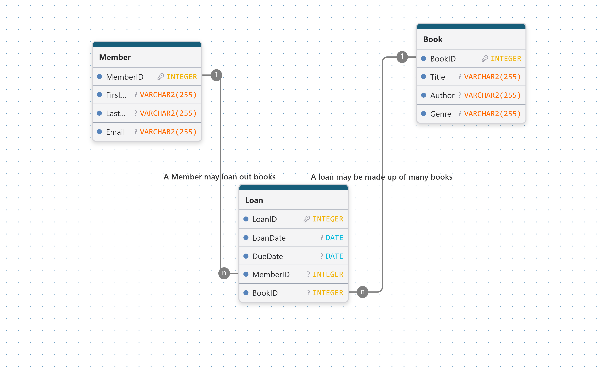
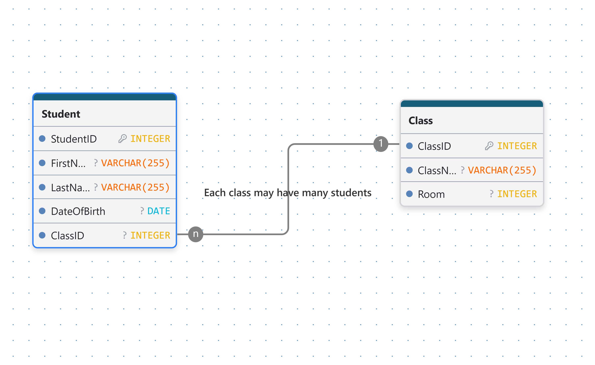
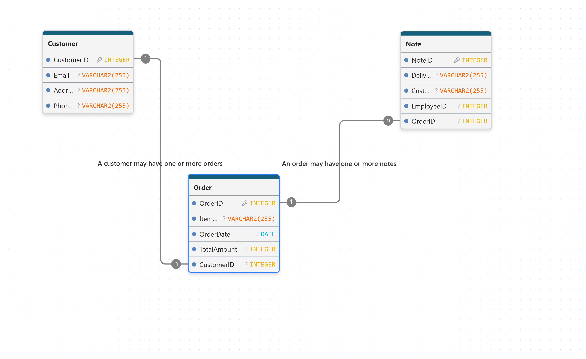
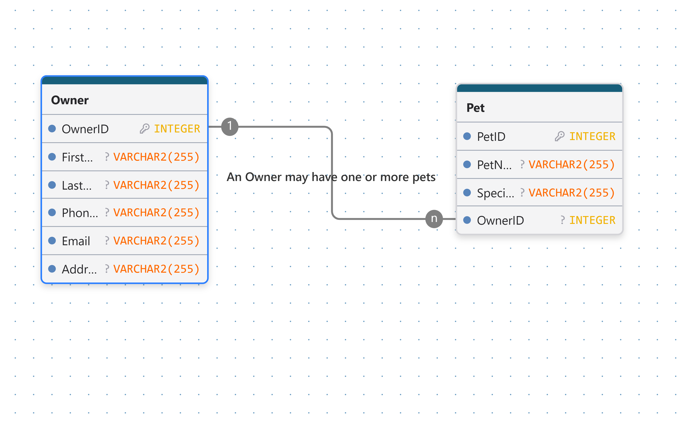
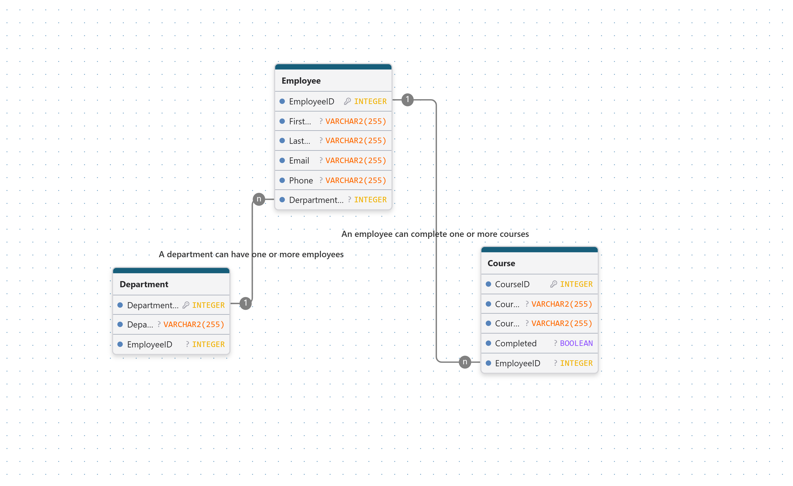
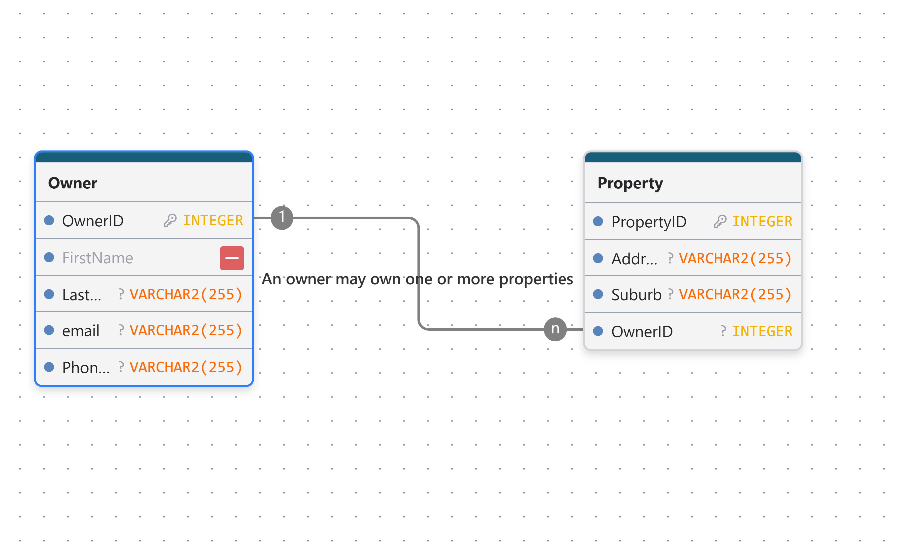
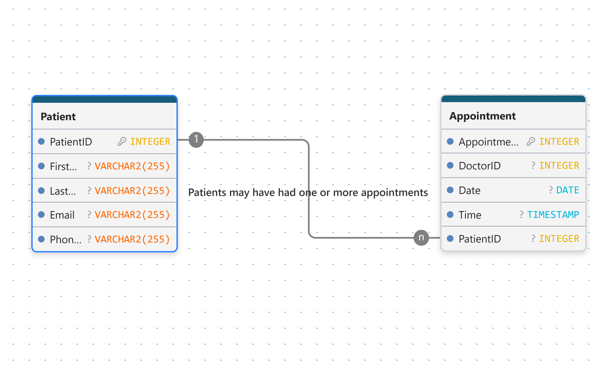
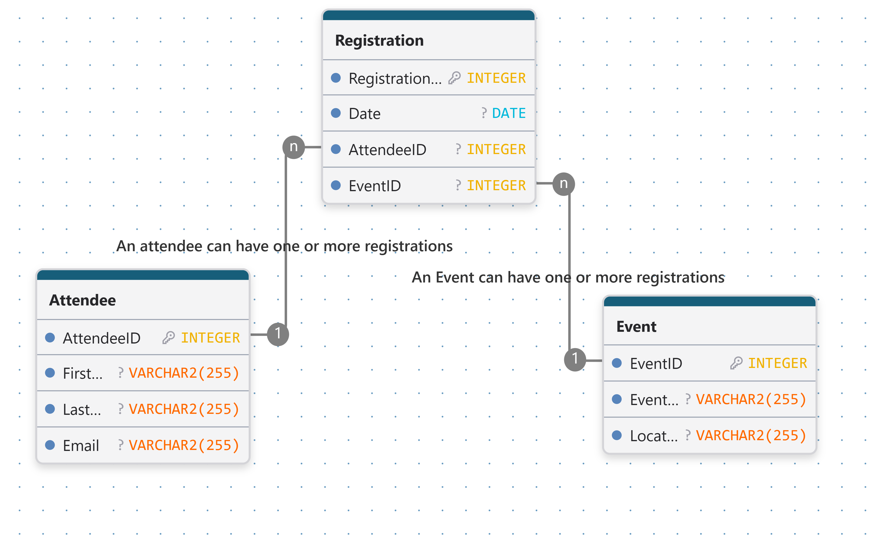
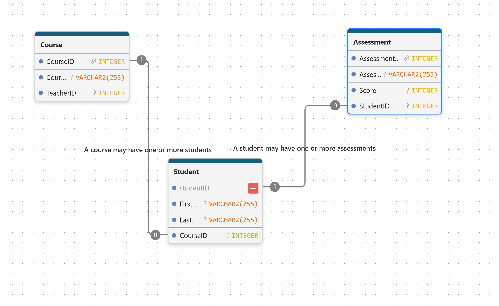
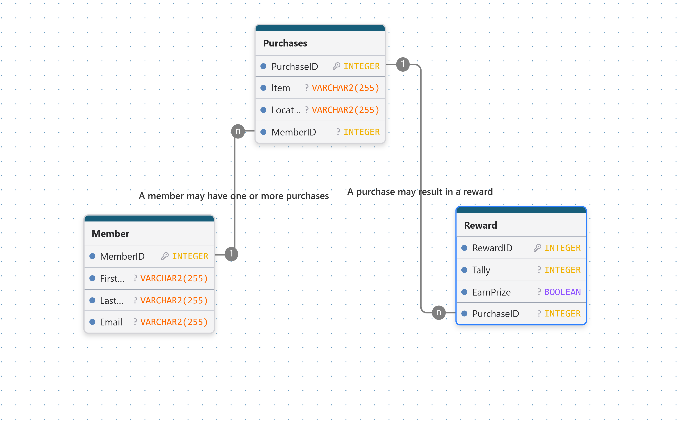

## 2. Data Redundacy identification activities. 
___
#### ***Task 1: Student Enrolments***

|StudentID |StudentName |StudentEmail |CourseID|CourseName|CourseDuration| 
|-|-|-|-|-|-|

>**studentName, studentEmail, courseName and courseDuration.** These are all bits of information that repeat and aren't unique keys.

>**StudentID** and **CourseID** are the only important ones.

#### ***Task 2: Customer Orders***

|Order ID| CustomerName| CustomerPhone| CustomerAddress |  ProductName| ProductPrice|
|-|-|-|-|-|-|

>The data redundacies would be the **CustomerName, CustomerPhone, CustomerAddress,** and **Product Price.**

>**OrderID** and **ProductName** are unique keys and can be used to identify the other things.

#### ***Task 3: Employee Training***

|EmployeeID|EmployeeName|Department|TrainingCourse|TrainingProvider
|-|-|-|-|-|

>The redundant data in this would be the **EmployeeName, Derpartment and TrainingProvider.** Since **TrainingCourse** is what's the important objective in this table, the **provider** becomes secondary and you see it repeating with the course. So that's why the **provider is redundant.**

>**EmployeeId** and **TrainingCourse** are keys. If I could, I would **change the TrainingCourse to a CourseID.**

#### ***Task 4: Vetinary Clinic***

|OwnerID| OwnerName| Phone| PetID| PetName| Species|
|-|-|-|-|-|-|

>In this scenario for the clinic the **owners name, phone number, PetName and species becomes redundant.** When you have the owner's ID, this becomes the easiest identifier and cannot change. names and phone numbers can change. PetID also won't change. PetNames can change if the owner wants, species can be indicated by the PetID so species becomes redundant.

>**OwnerID** and **PetID** are keys.

#### ***Task 5: Property inspections***

|PropertyID| Address| OwnerName| InspectionDate| InspectorName|
|-|-|-|-|-|

>In the case of **hosue inspections, Address, OwnerNAme, InspectionDate, InspectorName are all redundant.**
The reason why InspectorName is redundant is because you can simplify him with an employeeID or in this case an InspectorID. 

>So the only important keys in this case are the **PropertyID** and **InspetorID.**

## ERD Tasks: Practice Business Cases.

#### **Note:** I made phone numbers Variables because sometimes it may have a + in front for country code.
___
#### ***Task 3.1: Library Book Loans***

>"*A local library wants to keep track of its **members, books,** and **borrowing activity**. Members can borrow **many books** over time, and the library needs to record **when each book is borrowed** and when it is **due back**. The system should allow staff to see which member borrowed a book, the **details of the book**, and the **history of loans** made by each member.*"

___
#### ***Task 3.2: School Student and classes***

>"*A school organises **students** into **classes**. Each class has a name and is assigned to a room. A **class can have many students**, but **each student belongs to one class**. The school wants to store student details and be able to identify which class each student is currently assigned to.*"

___

#### ***Task 3.3: Customer Orders***

>"*An online store keeps records of its **customers** and the **orders** they place. A **customer can place many orders** over time. Each **order includes** information such as the **order date** and **total amount**. **Staff** may also **add notes to an order**, such as delivery instructions, customer requests, or follow-up comments. The store wants to **track(:) customers**, their **orders**, and any **notes linked** to those orders.*"

___

#### ***Task 3.4: Vetinary Clinic***

>"*A veterinary clinic stores information about **pet owners** and their **pets**. **Each owner can have one or more pets** registered at the clinic. The clinic needs to record owner **contact details** as well as basic pet information such as the **pet name** and **species**. Staff should be able to see which pets belong to each owner.*"

***

#### ***Task 3.5: Company Departments***

>"*A company is organised into **departments**. Each **department can have many employees**, but each **employee belongs to one department.** Employees may also complete **training courses** during their employment. The company wants to keep **employee details**, identify which **department they work in**, and maintain a record of **training completed by each employee**.*"

***
#### ***Task 3.6: Real Estate Agency***

>"*A real estate agency manages **property owners** and their **properties**. Each **owner can have one or more properties** listed with the agency. The **agency** needs to store owner **contact details** and property information such as **address** and **suburb**. Staff should be able to view all **properties connected to a particular owner**.*"

___
#### ***Task 3.7: Hospital Patients***

>"*A hospital stores details about its **patients**. Each **patient can attend the hospital many times** over the years for consultations, check-ups, and treatments. Whenever a patient visits, an **appointment record** is created that includes the **appointment date** and the **doctor** they will see. The hospital would like to keep a history of **all appointments associated with each patient.***"

***

#### ***Task 3.8: Event Management***

>"*A community organisation runs a **variety of events** throughout the year, such as **workshops**, **seminars** and **networking sessions**. **People can register** to attend these events. **Each registration is recorded** with the **date** it was made, and **attendee details** are captured for each registration. The organisation wants to **track which attendees have registered for which events** and maintain a history of all registrations.*"

___
#### ***Task 3.9: University Courses***

>"*A university offers a range of **courses** to **students**. Each **student is enrolled in one course and may complete multiple assessments** during their studies. **Assessment results** are recorded along with the **assessment name** and **score achieved**. The university wants to monitor student progress and maintain a record of **all assessment outcomes linked to each student and their course.***"

***
#### ***Task 3.10: Cafe Loyalty Program***

>"*A cafe operates a loyalty program for its regular customers. When **customers** join, their **membership details** are recorded. Each time a member makes a purchase, the **transaction is stored** in the system. Some purchases may result in the member receiving a **reward or benefit** through the loyalty program. The cafe wants to keep **track of member purchases and any rewards earned** over time.*"

___