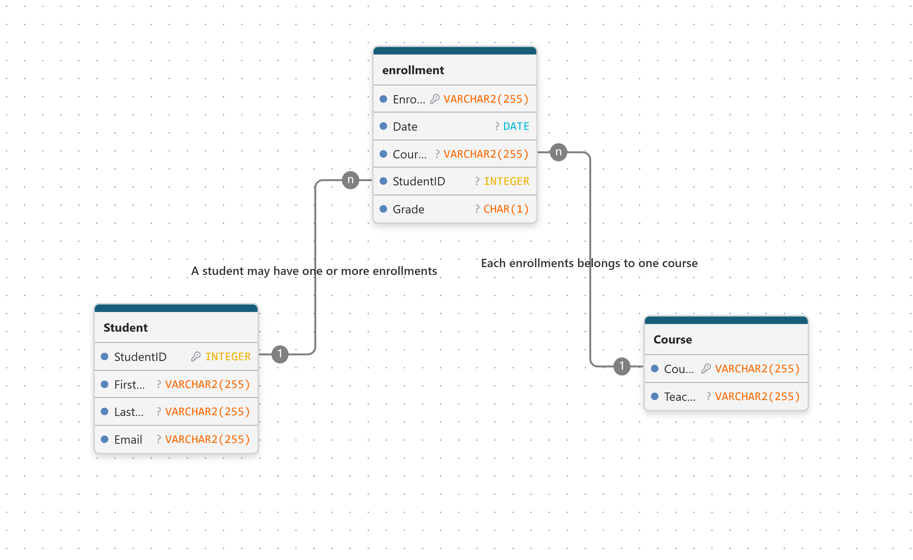
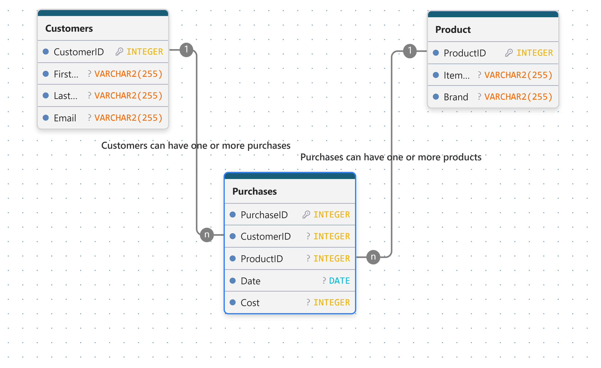

# 4. Many-to-Many Relationship Scenarios

### 4.1 students and courses.

>"***Students can enrol in several courses** throughout the year. Each **course may have many students enrolled**.*"

**Entities**
>- Students
>- Courses
>- Enrolments

1. Can a student enrol in multiple courses?
   "yes"
2. Can a course have multiple students? "yes"
3. What information should be stored in the Enrolments table? "EnrollmentID, StudentID, CourseID, Grade, Enrollment Date."

___

### 4.2 Customers and Products.

>An online store sells a variety of products.

>"*Customers can purchase multiple products in a single order, and the same product can be purchased by many different customers.*"

Entities
> - customers
> - Products
> - Purchases

1. Can a customer buy multiple products? "Yes"
2. Can a product be purchased by multiple customers? ""
3. What information should be stored about each purchase? ""

***

### 4.3 Employees and Projects.

>A software development company assigns employees to projects.

>"*An employee may work on several projects at the same time. Each project may have multiple employees assigned.*"

**Entities**

>- Employees
>- Projects
>- Assignments

1. Can an employee work on multiple projects?
2. Can a project have multiple employees?
3. What information could be stored in the Assignments table?
___
